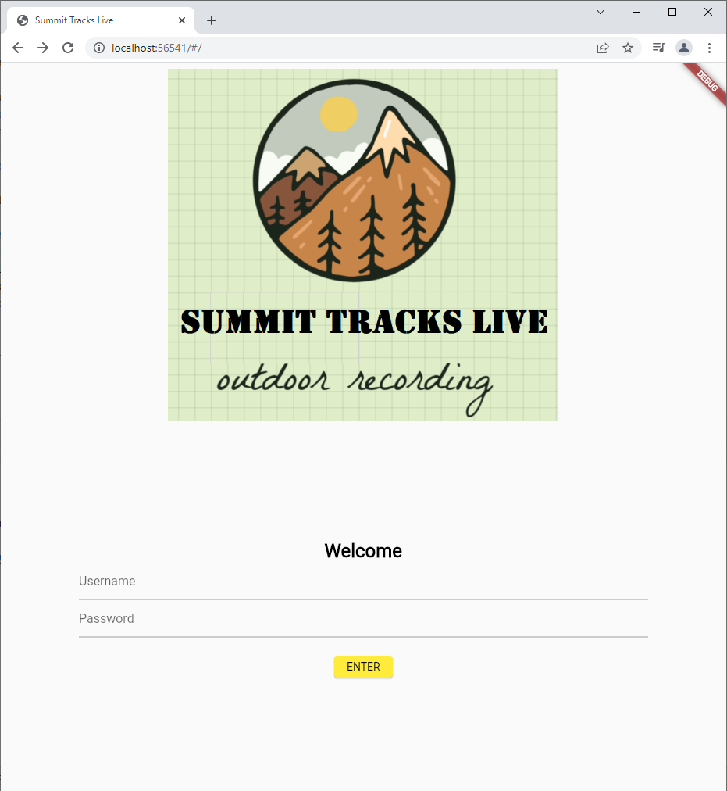

# Summit Tracks Live

STL is a demo of a fullstack application.
Features are :

    v.0.0.x Alpha version: display tracks, display menu, test persistance, gps, googlemaps, metadata, ...
    v0.1.x View Tracks: display tracks, current location for guiding a runner
    v0.2.x Misc: Import, Export GPX, Enrich with metadata, ...
    v0.3.x Follow a runner: find location of one or more runner, go to each steps using mobile GPS direction
    v0.4.x Live Run: follow an existing track, record a new track, while your runs

## Release

Current v 0.0.1



## Installation Flutter from Github
STL is a demo of a fullstack application, features are :
- [ ] Live Run, Follow an existing track (GPX)
- [ ] Live Run, Record a track (GPX)
- [ ] Support a runner: go to stops using GPS mobile
- [ ] View Live runners and position in a map
- [_] View Track and guide a runner
- [ ] Misc: Import, Export GPX, Enrich with metadata, ...

````bash
git clone https://github.com/flutter/flutter.git
export PATH="$PATH:`pwd`/flutter/bin"
````

Run flutter doctor to check the installation and finish. In any case read : https://flutter.dev/docs/get-started/install/linux#additional-linux-requirements

````sh
flutter doctor
Waiting for another flutter command to release the startup lock...
Doctor summary (to see all details, run flutter doctor -v):
[✓] Flutter (Channel master, 2.3.0-13.0.pre.97, on Ubuntu 20.04.2 LTS 5.8.0-53-generic, locale en_US.UTF-8)
[✓] Android toolchain - develop for Android devices (Android SDK version 30.0.3)
[✓] Chrome - develop for the web
[✓] Android Studio (version 4.2)
[✓] VS Code
[✓] Connected device (1 available)
````

## Android setup

Win
flutter config --android-studio-dir "C:\Program Files\Android\Android Studio"

Install the plugin Flutter and restart the IDE 

## Create the application skeleton
````bash
flutter create stl-gui
cd stl-gui
````

## Dependencies
### provider
A wrapper around InheritedWidget to make them easier to use and more reusable. By using provider instead of manually writing InheritedWidget, you get:

    * simplified allocation/disposal of resources
    * lazy-loading
    * a largely reduced boilerplate over making a new class every time
    devtools friendly
    * a common way to consume these InheritedWidgets (See Provider.of/Consumer/Selector)
    * increased scalability for classes with a listening mechanism that grows exponentially in complexity (such as ChangeNotifier, which is O(N²) for dispatching notifications).

### http
### line_icons
### flutter_dotenv
Allow to inject key/value inside the project.

#### For android
You need to manually apply a plugin to your app, from android/app/build gradle:
 *apply from: project(':flutter_config').projectDir.getPath() + "/dotenv.gradle"*
Then get a value:
    android:value="@string/GOOGLE_MAPS_API_KEY"

#### For iOs
Get a value in AppDelegate.swift:
    import flutter_config
    GMSServices.provideAPIKey(FlutterConfigPlugin.env(for: "GOOGLE_MAPS_API_KEY"))

#### For Web
Add your API key to `web/index.html` in the `<head>` tag:
```
<script src="https://maps.googleapis.com/maps/api/js?key=$GOOGLE_MAPS_API_KEY"></script>
```

## Chromium CORS
- [x] dart configuration here : /opt/flutter/packages/flutter_tools/lib/src/web/chrome.dart
uncomment and set data dir for CORS (create the folder CORS as below)
   '--user-data-dir=~/CORS',
comment disable extensions
   '//--disable-extensions',
   '--disable-web-security'

- [x] add headers in the HTTPS Server
  header.Set("Access-Control-Allow-Credentials", "true")
  header.Set("Access-Control-Allow-Methods", header.Get("Allow"))
  header.Set("Access-Control-Allow-Origin", "*")
  header.Set("Access-Control-Allow-Headers", "Origin,Content-Type,X-Amz-Date,Authorization,X-Api-Key,X-Amz-Security-Token,locale")
  header.Set("Access-Control-Allow-Methods", "GET, PUT, POST, OPTIONS")

- [x] add a CORS disable extension to chrome (i.e. chrome://extensions/?id=lfhmikememgdcahcdlaciloancbhjino)
  CORS-unblock
  CORS disable
  ...
- [x] remove  flutter/bin/cache/flutter_tools.stamp
- [x] restart android studio

# TODO
- [_] display /view, googlemaps with current location
- [ ] store signed-in user, to avoid sign in again
- [ ] root "/" page displays logo and background image
- [ ] display splash screen
- [ ] CICD - first version, stl-backend PR/branch merged => redeploy
- [ ] github ticket 
- [_] display googlemaps with the starting point of the selected Tracks
     set first point
   x display map
   x API keys (dev)
- [x] put 4 icons : View, Follow, Record, Live
- [x] fix issue index/position
- [x] display selected track from /Events
- [x] refactor Cart => Track Detail, Catalog => Events
- [x] configuration host/port, use flutter_dotenv
- [x] create api rest fake Album data (http)
- [x] button Go same color than Box item
- [x] change name of 'Add' button to 'Go'
- [x] align Model Catalog => Tracks
